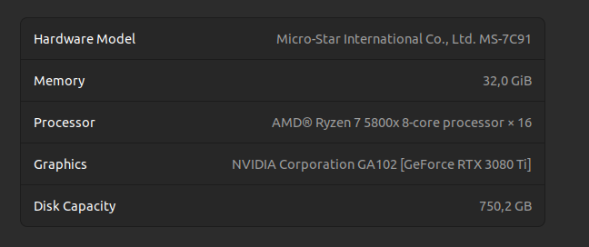
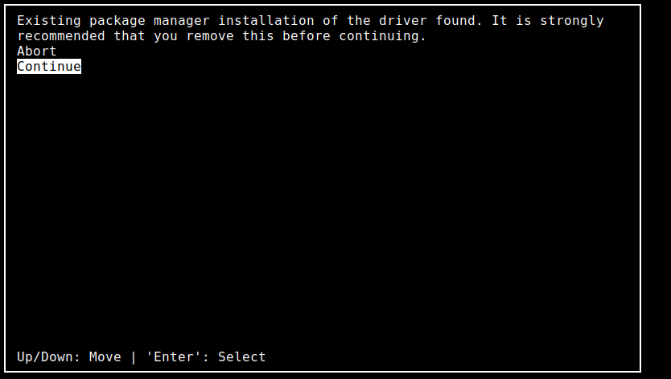
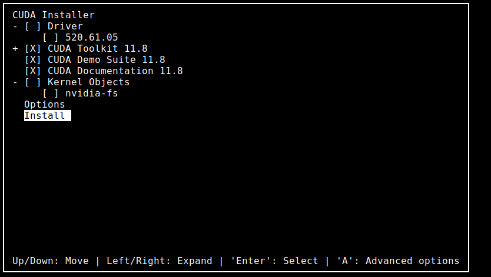
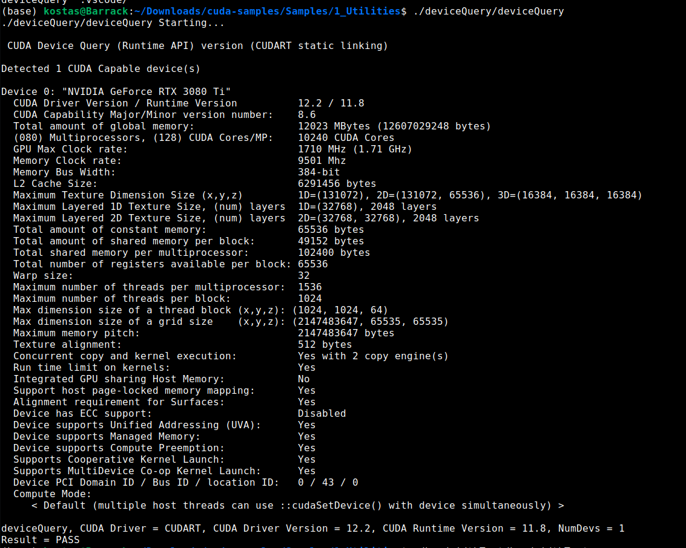
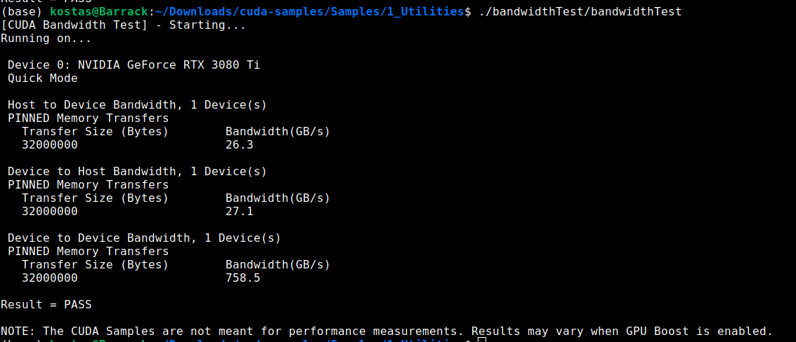
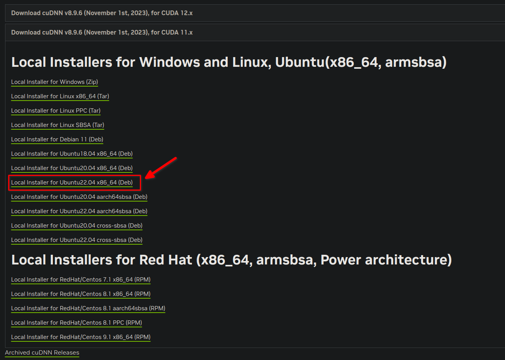

# Setting up Ubuntu 22.04 for deep learning with Cuda 11.8

## 0) Preperation:
```bash
$ sudo apt-get update
$ sudo apt-get install linux-headers-$(uname -r)
$ sudo apt-key del 7fa2af80
$ sudo apt-get install git gcc g++ cmake curl zlib1g libfreeimage3 libfreeimage-dev
```

## 1) Installing Nvidia drivers

On ubuntu open `Additional Drivers` and select the `(proprietary,tested)` driver version 535 or above.


Apply the changes and then reboot. 

## Verify Nvidia drivers installation

Open Settings and go to "About". 


Make sure in Graphics it says your gpu like this:



If it's not and its something like `llvmpipe`, then the nvidia drivers installation was NOT succesful. Try another version instead or reinstall.

## 2) Installing Cuda 
`Important: If you already have a version of nvidia drivers installed deselect the driver installer in the insallation script menu as the screenshots show below.`

```bash
$ wget https://developer.download.nvidia.com/compute/cuda/11.8.0/local_installers/cuda_11.8.0_520.61.05_linux.run
$ sudo sh cuda_11.8.0_520.61.05_linux.run
```




After the installation has finished verify the existence of the cuda files in `/usr/local/cuda-11.8`


Then add these to the `PATH` variable:

```bash
$ export PATH=/usr/local/cuda-11.8/bin${PATH:+:${PATH}}
$ export LD_LIBRARY_PATH=/usr/local/cuda-11.8/lib64\
                         ${LD_LIBRARY_PATH:+:${LD_LIBRARY_PATH}}
```

## Verify Cuda installation

Download the cuda samples :

```bash
$ git clone https://github.com/NVIDIA/cuda-samples
$ cd cuda-samples
```
Checkout to the cuda version and make.

```bash
$ git checkout v11.8
$ make
$ cd Samples
```
Finally run the `deviceQuery` and `bandwidthTest` located in the `1_Utilities` directory and make sure they both PASS.





## 3) Installing cuDNN

Navite to Nvidia's cudnn page and login to download the cudnn library.

https://developer.nvidia.com/cudnn

Install the deb packge for 11.x version of cuda.



`Run the following commands replacing 8.x.x.x with your cudnn installation version and cudaX.Y with your cuda version.
(In this case it's cudnn version 8.9.6.50 .and cuda11.8) `

```bash
$ sudo dpkg -i cudnn-local-repo-$distro-8.x.x.x_1.0-1_amd64.deb
$ sudo cp /var/cudnn-local-repo-*/cudnn-local-*-keyring.gpg /usr/share/keyrings/
$ sudo apt-get update
$ sudo apt-get install libcudnn8=8.x.x.x-1+cudaX.Y
$ sudo apt-get install libcudnn8-dev=8.x.x.x-1+cudaX.Y
$ sudo apt-get install libcudnn8-samples=8.x.x.x-1+cudaX.Y
```
## Verify cuDNN installation
Make sure the samples are properly downloaded at `/usr/src/cudnn_samples_v8/` and then compile the `mnistCUDNN` sample.

```bash
$ cp -r /usr/src/cudnn_samples_v8/ $HOME
$ cd  $HOME/cudnn_samples_v8/mnistCUDNN
$ make clean && make
$ ./mnistCUDNN
```

If cuDNN is properly installed and running on your Linux system, you will see a message similar to the following:

```bash
Test passed!
```

## Last Verify tensorflow and pytorch are working

Install miniconda if not installed already:

https://docs.conda.io/projects/miniconda/en/latest/

Create a conda environment with python version>11.0 and 
install through pip the `tensorflow` and `pytorch` packages following the instructions listed on each ones installatation documenation.


Install pytorch as described at:

https://pytorch.org/get-started/locally/

Install Tensorflow as described at:

https://www.tensorflow.org/install


To test if they are working on cuda run these inside the environment you installed them afterwards:

### Pytorch 

```python
>>> import torch
>>> torch.cuda.is_available()
 True
>>> torch.cuda.current_device()
 0
>>> torch.cuda.cuda.device(0)
 NVIDIA Geforce RTX 3080 Ti
```

### Tensorflow

```python
>>> import tensorflow as tf
>>> tf.test.is_gpu_available()
 True
```

`PS: Pytorch and tensorflow may have a lot of warnings but as long as there are no errors and the tests return True it's okay. `
### Documentation used:
Documentation for Nvidia driver installation in Linux:

https://docs.nvidia.com/datacenter/tesla/tesla-installation-notes/index.html

Documentation for Cuda Installation in Linux:

https://docs.nvidia.com/cuda/cuda-installation-guide-linux/index.html

Documentation for cuDNN Installation in Linux:

https://docs.nvidia.com/deeplearning/cudnn/install-guide/index.html
